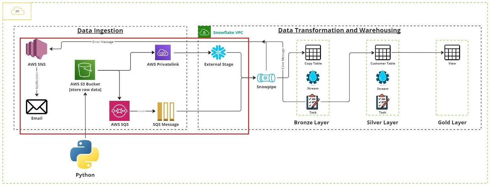

## Project 3: ELT SDC1

### Project Overview
This project implements a pipeline to handle full data loads and change data (CDC) file from a Python process, store the data in AWS S3, and use Snowflake’s native features — Snowpipe, Streams, Tasks, and Stored Procedures — to automatically load and update a Customer table with SCD Type 1 logic.

### Benefits
- Automated full & incremental loads  
- Zero manual file handling — everything runs on Snowflake side once data lands in S3  
- No duplicate work — Stream ensures only new/changed rows are processed  
- SCD1 logic guarantees the CUSTOMER table always has the latest values — old data is overwritten as required  
