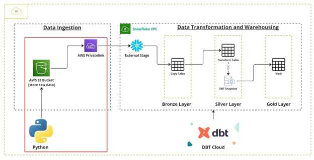

## Project 4: ETL SCD2 using DBT and Snowflake

### Objective	
We are going to set up an AWS S3 bucket. Also, will load the ‘.csv’ data file into the bucket using a python script. This will ensure we have our data loading capability from our local systems.  

### Architecture

