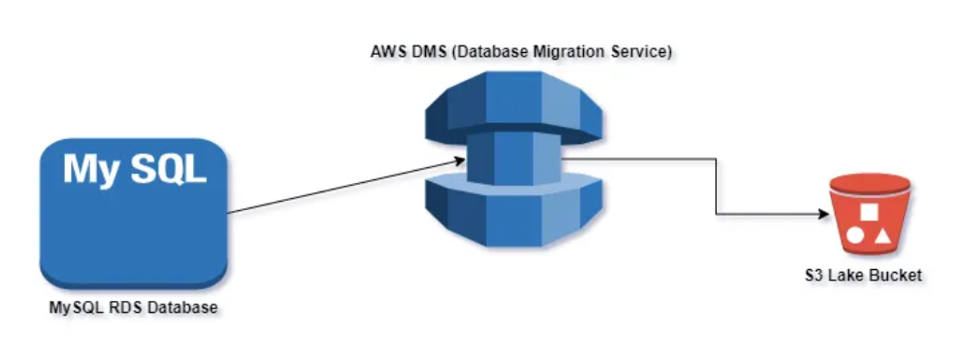

## Project 6: Data Ingestion using AWS DMS

### Project Overview
In this project, we want to run a near-real-time CSC data ingestion using DMS. The source bucket will be RDS, and the target bucket will be S3. The source database is MySQL-based; therefore, we will update the data into RDS using MySQL Workbench from our local machine. We need an IAM role to give access permissions to other AWS services for DMS. Also, we need a secret manager to keep the username and password to access the RDS table.

